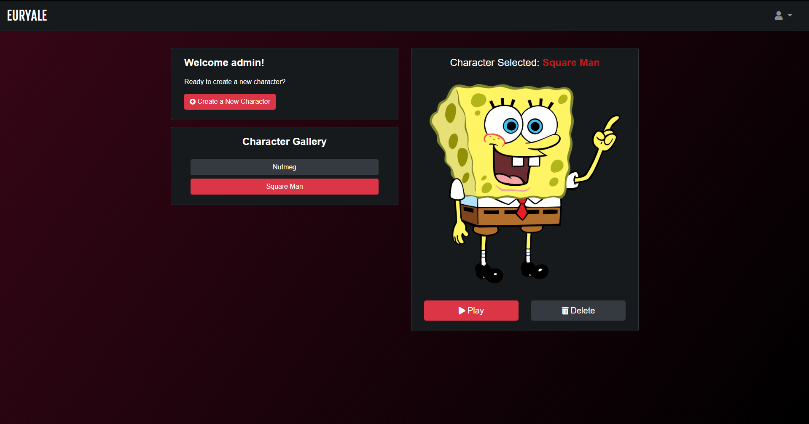

# **COMPSCI 326 - Final Report**

## **Group ETA**

### **Euryale**

*Online Dungeons & Dragons Character Sheet Tool*

- [Euryale Website Link](https://pacific-cove-11560.herokuapp.com/)

- Created as a final project for COMPSCI 326 Fall 2020

Euryale is a web application that seeks to improve the Dungeons and Dragons (D&D) experience by making the character sheet process of the game easier to use. Oftentimes, when most D&D players utilize character creation sheets, they'll use a physical copy that's static—the process of creating a character in the game can be incredibly boring and tedious with the game's complex and long rules. Some might not even know that character creation sheet websites exist! There are a lot of available online character creation sheets, but most of them are outdated and complicated. That is why Euryale was created. Euryale allows D&D users to easily create, manage and download their character sheets. The idea of this project is not the most innovative since character sheet applications already exist. Nonetheless, it was created to redesign and improve upon existing products as an attempt to further enhance the D&D gaming experience. 

Team Members:
- Jackson Callaghan: *[jackson-callaghan-school](https://github.com/jackson-callaghan-school)*
- John Tan: *[weijohntan](https://github.com/weijohntan)*
- Hans Quiogue: *[hansquiogue](https://github.com/hansquiogue)*

*Note: Jackson also has accidentally made multiple commits from his private account, previously named jackson-callaghan, but now named [tokebe](https://github.com/tokebe). Apologies for the confusion.*

*Disclaimer: Our application also used external images. Our group does not claim to own these images. The copyrights belong to the original owners.*

Images Used:
- Favicon: [Official D&D logo](https://dnd.wizards.com/)
- Homepage:
    - [Red Dragon](https://wall.alphacoders.com/big.php?i=678272)
    - [Forest](https://wall.alphacoders.com/big.php?i=1116810)
    - [Gray Dragon](https://wall.alphacoders.com/big.php?i=749770) 
- Login: [Monster](https://wallup.net/dungeons-dragons-artwork-fantasy-art/)
- Register: [Worm Monster](https://wallup.net/dungeons-and-dragons-fantasy-adventure-board-rpg-dungeons-dragons-79/)
- Gallery and Sheet: [Default Character](https://www.artstation.com/artwork/rXNWe) 

## **User Interface**

**Login/Register**: a place for users to sign in or register a new account:

Login page for users to log in
 

Registration page for users to create a new account
 

**Character Gallery**: a user’s personal page to create, manage and delete their character sheets. At the moment, users will only be able to access their page and no one else's.

Here, a user can select one of their characters by clicking one of the character names under “Character Gallery”:

Selecting a character
 

The character’s name will be highlighted in red and will be displayed above the character image to indicate that character has been selected. Once they click play, they will be redirected to the character sheet of that selected character.

A user can also click “Create a New Character” to make a new character:

Creating a new character
 

A modal will pop up where the user can input a character name and click a button to create one.

A user can also select a character and click “Delete” underneath the selected character’s image to delete a character:

Deleting a character
 

Another modal will pop up as a confirmation message to the user asking them if they are sure they want to delete that character. The character will be deleted forever once the button is clicked. 

**Character Sheet**: the page for users to manage a character’s attributes. Like before, users will only be able to access their own characters. A user can edit the entire character sheet to their liking.

A user can save their save their character sheet by clicking the “Save” button on the right side of the page:

Saving a character sheet
 

An alert will pop up as an indicator to the user that the sheet has been saved. Another note is that our application features an autosave feature that attempts to save a character sheet every 60 seconds. 

A user can also update a character’s image by clicking “Change Image” on the bottom right side of the character image in the center of the page:

Uploading a new character image
 

A modal will pop where the user can input an image link and click the button to update their character to the new image. 

A user can also click “Export” in the top right corner of the page to download a character sheet:

JSON file after exporting the character sheet
 

A download will appear of the character sheet in JSON format.

A user can also click “Reset” in the top right corner of the page to reset the entire character sheet:

Resetting a character sheet
 

An alert will pop up asking the user if they are certain that they want to reset the entire sheet.

## **APIs**

**GET Requests**:
- /: the homepage
- /login: a page for users to log in
- /register: a page for users to create a new account
- /register-successful: the page where a user is redirected to after they have successfully registered
- /user/:user/characters: returns a user’s character names in an array
- /gallery/user/:user: a user’s character gallery page
- /gallery/user/:user/character/:character: a user’s character sheet page
    - If the character sheet does not exist, the user will be redirected back to their gallery
- /character/create: creates a new character for a user
- /char-sheet-export/user/:user/character/:character: exports a user’s character sheet
- /logout: logs a user out
- /404: a page where users are redirected to if they attempt to go to a path that does not exist in the website

**POST Requests**:
- /login: requested when a login attempt is made
    - If successful, a user is redirected to their character gallery
    - If there is a failure, the user is redirected to the login page that states the error they might’ve made
- /register: requested when a register attempt is made
    - A user’s password will be hashed and salted using [miniCrypt](https://github.com/hansquiogue/cs326-final-eta/blob/master/server/miniCrypt.js) (written and provided by [Joseph Spitzer](https://github.com/sp1tz)), based on the crypto library.
    - If successful, the user is redirected to the register successful page
    - If there is a failure, the user is redirected back to register page with an error message they might’ve made
- /char-sheet-save/user/:user/character/:character: saves a user’s character sheet

**DELETE Requests**:
- /character/delete: deletes a user’s character

## Database

// TODO

## URL Routes/Mapping

Main Pages:

- /: the homepage
- /login: a page for users to log in
- /register: a page for users to create a new account
- /register-successful: the page where a user is redirected to after they have successfully registered
- /gallery/user/:user: a user’s character gallery page
- /gallery/user/:user/character/:character: a user’s character sheet page
- /404: a page where users are redirected to if they attempt to go to a path that does not exist in the website

## Authentication

User authentication is achieved when a user enters the proper credentials on the Euryale login page. On the server side, [Passport](http://www.passportjs.org/) is used as a middleware for authentication when a user makes login attempts. The local authentication strategy is used. Except for the homepage, 404 page, and login or registration pages, a user will need to be authenticated to access the rest of the application; unauthorized users will not be able to access most of the UI such as a character gallery and character sheet, and UI views that correspond to those interfaces.

## Division of Labor

// TODO

## Conclussion

// TODO