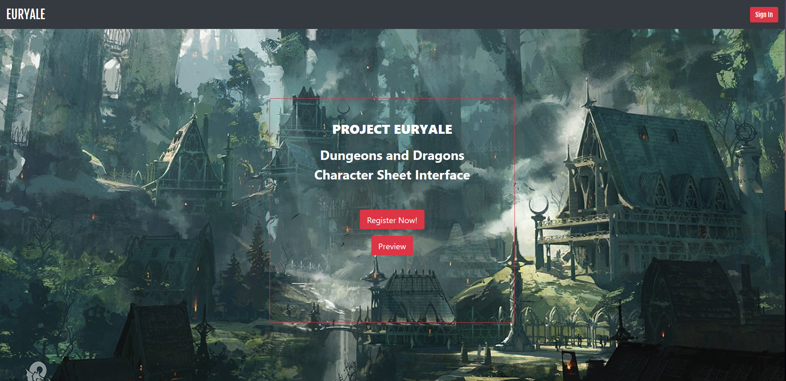
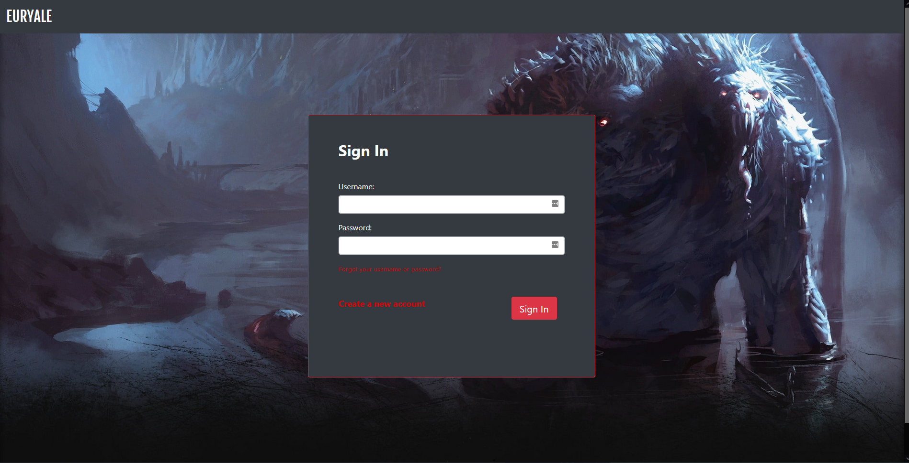
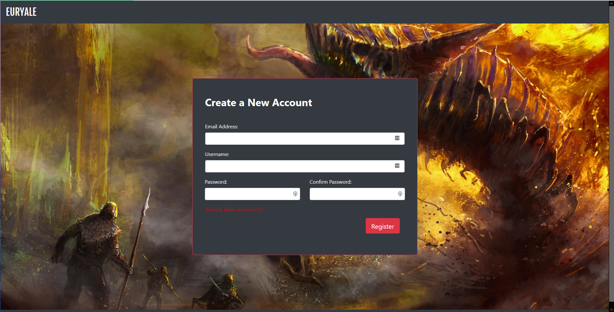
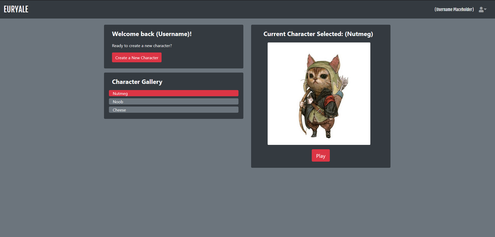
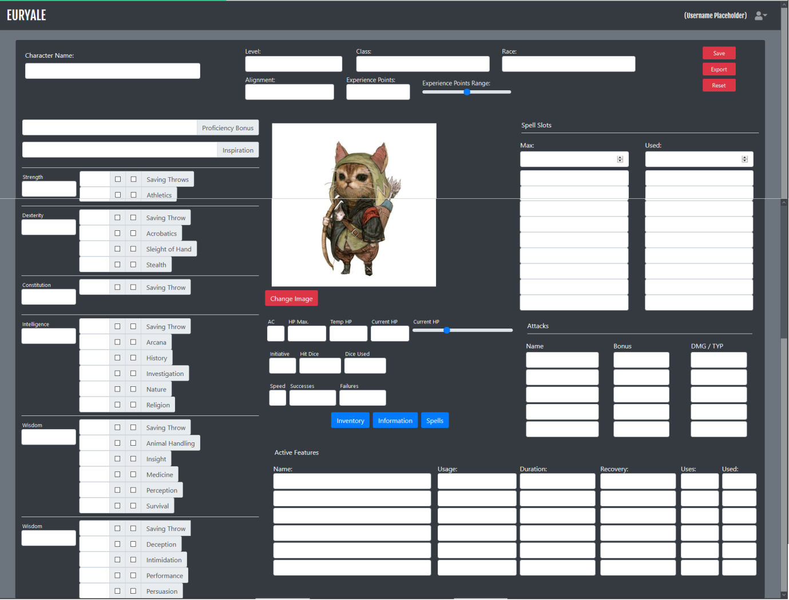
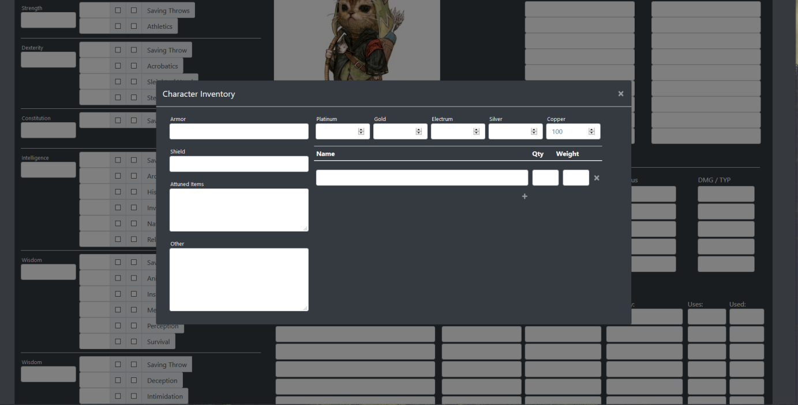
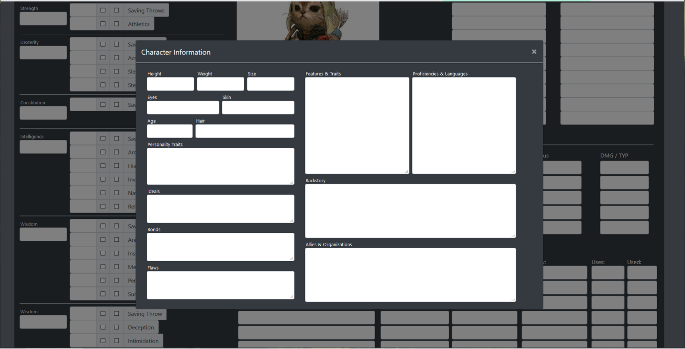
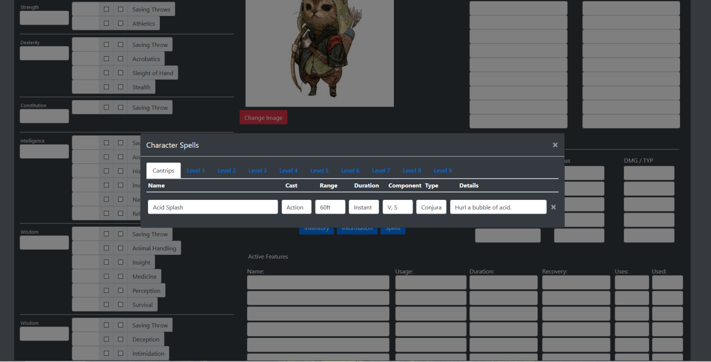

# COMPSCI 326 - Final Project Milestone 1

## Group ETA

- Jackson Callaghan: *[jackson-callaghan-school](https://github.com/jackson-callaghan-school)*

- John Tan: *[weijohntan](https://github.com/weijohntan)*

- Hans Quiogue: *[hansquiogue](https://github.com/hansquiogue)*

## Project Euryale

### *Online Dungeons & Dragons Character Sheet Tool*

### **Innovative Idea**

Our group wants to improve the Dungeons and Dragons (D&D) experience by making the character creation sheet portion of the game more convenient to use. Often times, when most D&D players utilize character creation sheets, they'll use a physical copy that's static—the process of creating a character in the game can be incredibly boring and tedious with the game's complex and long rules. Some don't even know that character creation sheet websites exist! There are a lot of available online character creation sheets, but most of them are outdated and complicated. That is why our group is creating this project. Our goal is to create a website that lets D&D users have an automated character sheet that's easy to use and centralized in a space with nice visuals. The website will be convenient for D&D users since they'll be able to plug in their statistics, from backgrounds, skill points, and more, and the website will be able to convert the input into the correct format so that users don't have to manually do any calculations. The website will also enable a greater D&D experience aswell since it will allow a user to import their personal touches to their characters, such as an image of their character. The website will also look modern and be straightforward to use. Overall, the idea of this project is to not make something super innovated, but rather to create a product that will be convenient to a very niche group of individuals and improve their gaming experience.

### **Important Components**

The main functionality of our application is to take in various user inputs from a DnD character sheet. Using a DnD character sheet can be a fairly grueling and complex task—when starting a new game, it might even take hours for a group with beginners to fill everything in the sheet in, and the game hasn't even started! Our website will be able to take in a user's character sheet input and automatically output back the correct calculated statistics and values. For example, a user could input their skills to their character and our website will account for skill bonuses and automatically update the value based on the bonus. Our website will allow creativity for users and enable them to personalize their characters. A feature could be allowing them to upload an image of their character—some character sheets won't even have a spot for a user to visualize their character! Our website could also include a dice roller, as the die is a vital part of the game.

### **Data Interactions Summary**

To summarize, user data interactions will be as follows:

- Entering, referencing and automatically updating character statistics on a character sheet
- Saving all generated character sheets for each user to the server for later retreival
- Exporting character sheets as either PDF or JSON

## **Wireframes**

Here is the Euryale homepage:

This page will explain what Euryale is, a DnD character sheet interface. There will also be buttons to sign in, register and preview what the application can do.

Here is a basic sign-in and registration page:

Here is the page to manage and select a user's character sheets: 

In this page, they will be able to create a new character sheet or manage their current character sheets. With current character sheets, they can select one to manage, export to a PDF or JSON file, or delete a character sheet.

Here is the real meat of the project - the character sheet page: 

Users are presented with a large number of inputs, mirroring those on official DnD (5th edition) character sheets. Inputs automatically populate from the saved sheet, with some numbers automatically calculating their own values based on 5e rules. These can be overwritten by the user. 

Below are pop-ups that appear when a user clicks either the Inventory, Information or Spells button.

A pop-up screen for detailed inventory management.

A pop-up screen for detailed character information.

A tabbed pop-up screen to keep track of spells.

## **HTML & CSS Implementation**

Below are the same screens as the wireframe as currently implemented in HTML and CSS. A lot of polish is still required, however much of this is simply due to the fact that the majority of each page is high functional and at least partially will depend on the in-depth JS implementation. Additionally, due to the nature of how many inputs and how much structure is required for this project, a lot of alignment, spacing, and coloring had to be left for the next milestone.

(Unpolished) Character Sheet Page:

Pop-ups created with modals:

## **Division of Labor** 

John: 
- Homepage HTML/CSS/Wireframe 
- Character Sheet Wireframe
- Spell Slots Portion of Character Sheet HTML/CSS 
- Attack Portion of Character Sheet HTML/CSS 

Jackson: 
- Milestone Writeup
- Character Sheet Wireframe
- Left Side/Center Portion of Character Sheet HTML/CSS
- Pop-ups in Character Sheet HTML/CSS

Hans:
- Writeup Editing
- Login/Registration/Selector Wireframe and HTML/CSS
- Top Portion/Active Features/Image Portion of Character Sheet HTML/CSS