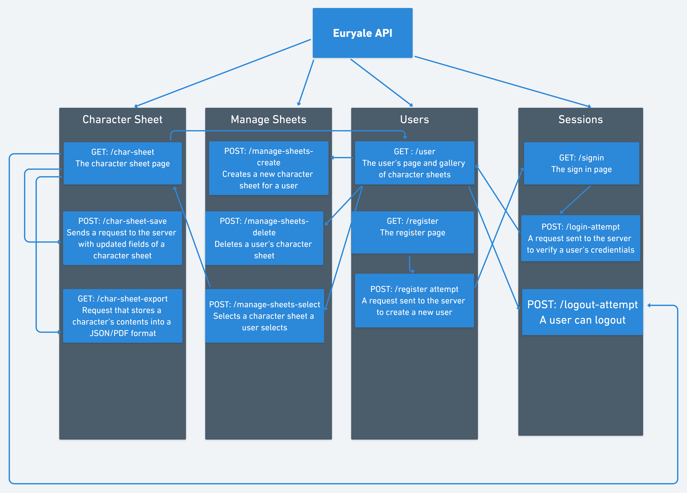
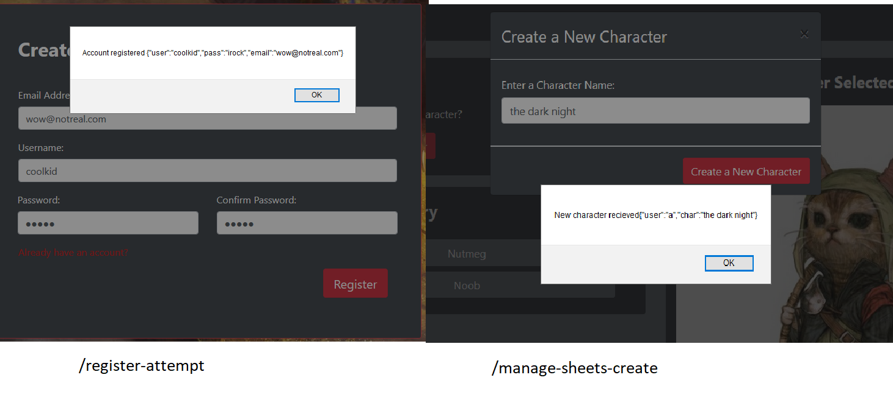
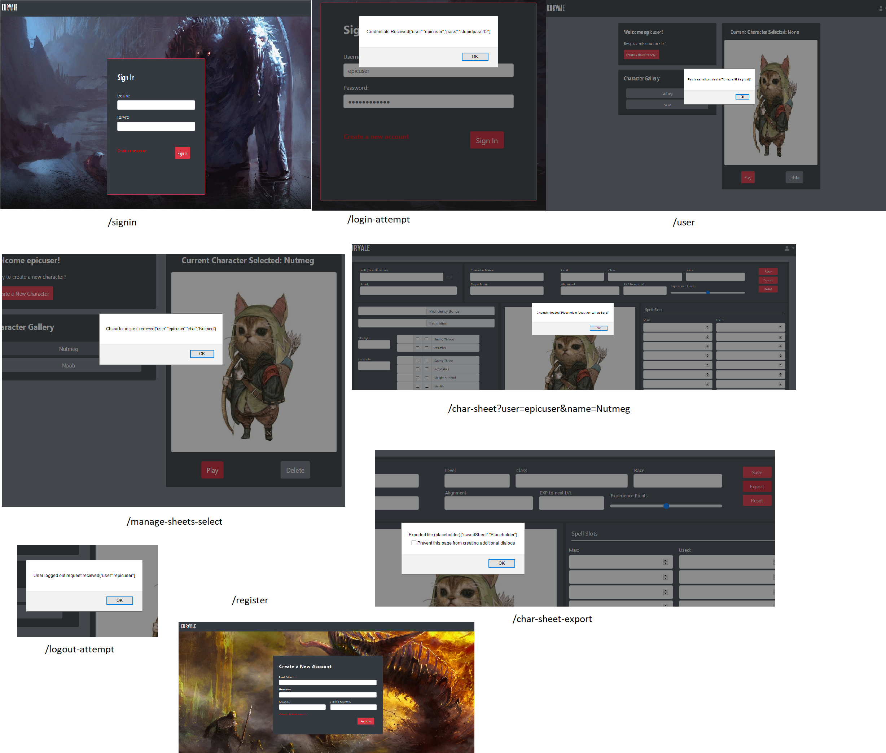
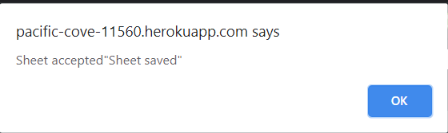
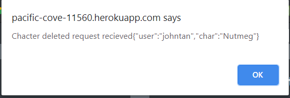

# **COMPSCI 326 - Final Project Milestone 2**

## **Group ETA**

- Jackson Callaghan: *[jackson-callaghan-school](https://github.com/jackson-callaghan-school)*

- John Tan: *[weijohntan](https://github.com/weijohntan)*

- Hans Quiogue: *[hansquiogue](https://github.com/hansquiogue)*

## **Project Euryale**

### *Online Dungeons & Dragons (DnD) Character Sheet Tool*

---

- [Euryale Website Link](https://pacific-cove-11560.herokuapp.com/)

NOTE: At the character selection gallery webpage, make sure you select a character first before performing a CRUD operation. There is currently no warning or message that states if you have selected a character or not, so it might seem like the operations are not working. In reality, nothing would occur because no character has been selected.

## **Application Structure**

The purpose of Euryale is to store and manage a user's DnD character sheets as a web application. To start implementing this, our group split up our application structure into these main components:

- **User Objects** - each has these fields: username, email, password, and a list of characters. 

- **Character Sheet Objects** - each has a multitude of fields a character sheet can have. [Here is a template](https://github.com/hansquiogue/cs326-final-eta/blob/master/character-sheet-template.json) of what the fields will look like. 

- **Session Objects** - each has these fields: username and a hashed password. Perhaps there will be a token field to help with authentication. 

- **Manage-Sheets** - a relationship between **one user** and **multiple characters sheets** that belong to the user. As the name implies, this relationship will help manage a user's gallery of character sheets. 

## **Project API Planing**

Above is a flowchart of all the APIs our server will provide. 

Here are some example endpoints we will be using:

- **/user** will be a user's page that contains their character sheet collection. When the page loads, a request will be sent and return an array of the user's characters.
- **/manage-sheets-create** will create a new character sheet for a user. It will return a character sheet with blank fields except for the character's new name.
- **/char-sheet?user=guest&char=Ayxl** will load user guest's character Axyl. (Assuming the user and character sheet exists and that the user has been authenticated as well). In our implementation, we currently have a token as an addition to the GET query.

Note: We have added or did not tokens for certain endpoints because we are currently unsure of how we are implementing user authentication for this milestone.

Due to time constraints and other factors, some of our endpoint names in our server are named differently from our proposed implentation. Outside of that, everything should work fine. We will change everything accordingly to be consistent with everything for the next milestone.

## **Client Interface**

To display our CRUD operations and to show that a client can recieve responses from our server, we have displayed alerts that will contain what we believe should be the responses or outputs into a database. We will be removing these alerts before the release of the final product.

#### *Create*

- **manage-sheets-create** - Creates a new character sheet for a user. The response should actually contain a character sheet object with empty fields except for the character name. Since we have not implemented the database however, we used "user" and "char" keys as a placeholder.

- **register-attempt** - Creates a new user account.

#### *Read*

-**/signin** - The sign in page.

-**/login-attempt** - Clicking the sign in button will send a POST request to authenticate a user’s credentials. If they are valid, the user will be redirected to their respective character selection gallery.

-**/user** - Loads a user's page that stores their character sheet gallery. When the page loads, a response will be retrieved of an array of the user's characters. 

-**/char-sheet** - Loads a character sheet. When the page loads, a response will be retrieved from the database which contains a JSON file of the character's fields.

-**logout-attempt** - Will take the user out of the current page and puts them back into the homepage.

-**/register** - The register page.

-**/char-sheet-export** - For now, this endpoint will output a JSON file of all the fields of the character sheet. We might change this implementation later to create a PDF with the fields perhaps.

-**manage-sheets-select** - When a user clicks a character, a POST request will be sent to retrieve a user’s character. Depending on how we implement **/user** when creating the database in the next milestone, we might not need this endpoint. 

#### *Update*

- **char-sheet-save** - Whenever a user saves their character sheet, a POST request will be sent to the server with all the information a user plugged in the character sheet inputs. The character sheet's fields will be updated based on the inputs a user made. In the actual implementation, the response a database shoud be recieving is the JSON that contains the all the new character sheet inputs. Since we didn't have the database implementation, we used a placeholder string that states when a character sheet is saved if the response to server was successful.  

#### *Delete*

-**char-select-delete** - Deletes a specified character sheet in the character selection page.

## **Division of Labor**

Hans:
- Front-end implementation (Manage Sheets)
- Back-end skeleton (Manage Sheets/User/Session Endpoints)
- Writeup editing 

Jackson:
- Front-end implementation (Character Sheet)
- Back-end skeleton (Character Sheet Endpoints)
- Writeup

John:
- Writeup
- Heroku Deployment
- Front-end implementation (Homepage/Login/Register)