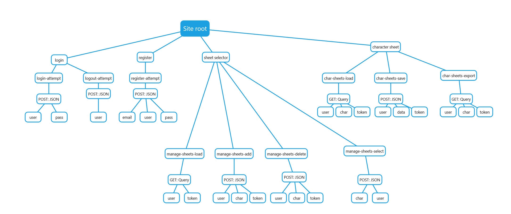

# **COMPSCI 326 - Final Project Milestone 2**

## **Group ETA**

- Jackson Callaghan: *[jackson-callaghan-school](https://github.com/jackson-callaghan-school)*

- John Tan: *[weijohntan](https://github.com/weijohntan)*

- Hans Quiogue: *[hansquiogue](https://github.com/hansquiogue)*

## **Project Euryale**

### *Online Dungeons & Dragons Character Sheet Tool*

[Euryale Website Link](https://pacific-cove-11560.herokuapp.com/)

### **API Flow Chart**

### **Client Interface**

#### *Create*

- **char_sheet_export** - Creates a downloadable text doucment that the user can use outside of the website.
- **create_char** - Creates a new character profile.
- **register_account** - Creates a new user account to keep all character sheets.
#### *Read*

-**char_sheet_popup** - Reads in the user/pass credentials and redirects user to the character selection page.

-**log_out** - Will take the user out of the current page and puts them back into the homepage.

-**manage_sheets_load** - Whenever a user is signed in, they will get directed to the character selection gallery webpage. When this page loads, a GET request is sent to the server to retrieve an array of the user’s characters. All elements in the array will be used to generate a list of characters a user can select.

-**play_button** - When the play button is clicked, a POST request is sent to the server to retrieve a user’s character. 

-**sign_in** - Clicking the sign in button will send a POST request to authenticate a user’s credentials. If they are valid, the user will be redirected to their respective character selection gallery.

-**log_out** - Reads the users credentials (username/password) and logs them out of the website

#### *Update*

- **char_sheet_save** - Whenever a user saves their character, a POST request will be sent to the server with all the information plugged in the character sheet inputs.
#### *Delete*

-**char_select_delete** -
## **Division of Labor**

Hans:
- Front-end implementation
- Back-end skeleton
- Sever code 

Jackson:
- Front- end Implementation
- Back-End Skeleton
- Server code

John:
- Writeup Edition
- Heroku Deployment
- Front-End Implementation